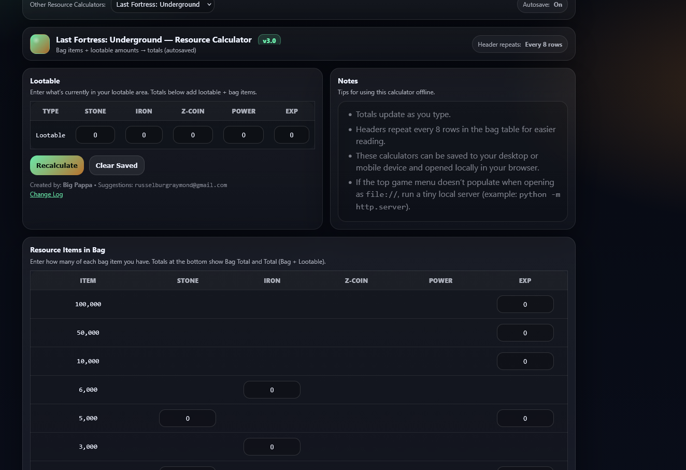

# 🎮 Game Resource Calculator

<p align="center">
  <strong>A collection of powerful, offline-capable resource calculators for popular mobile and strategy games.</strong>
</p>

<p align="center">
  Plan smarter, optimize resources, and make better decisions across multiple games — all from one clean interface.
</p>

---

<p align="center">
  
  
  
  
</p>

---

## 📸 Screenshots

<p align="center">
  
  
  
</p>

---

## 🚀 What is Game Resource Calculator?

**Game Resource Calculator** is a multi-tool utility designed to help you:

* Track and calculate in-game resources
* Optimize upgrades and spending
* Compare different strategies instantly
* Work entirely offline (no server required)

It’s built for players who want **precision, speed, and control** over their gameplay decisions.

---

## 🧠 Included Calculators

### 🌍 Atlas Earth Rent Calculator

* Parcel income tracking
* Badge vs Parcel comparison
* SRB (Super Rent Boost) projections
* Real-time income calculations

---

### ⚔️ Guns of Glory Resource Calculator

* Farm & estate resource tracking
* Lootable vs protected calculations
* Upgrade cost comparisons
* Multi-account grid support

---

### 🏰 Last Fortress: Underground Calculator

* Lootable resource tracking
* Bag + looted totals combined
* Auto-saving inputs
* Optimized for quick decision-making

---

## ✨ Key Features

* ⚡ **Instant calculations** — no page reloads
* 💾 **Auto-save support** — keeps your progress
* 📊 **Strategy comparison tools**
* 🧩 **Multi-game support in one interface**
* 📴 **Offline-ready (open locally in browser)**
* 🎯 **Clean, dark-themed UI**

---

## 🛠️ Installation

1. Download the latest release ZIP
2. Extract into your web server directory
   *(or open locally for static tools)*
3. Open in browser:

```
http://localhost/Game_Resource_Calculator
```

---

## 💡 Usage Tips

* All inputs update instantly — no “submit” needed
* Data is saved automatically per device
* Works offline once loaded
* For best compatibility when opening locally:

  * Use a simple server if needed:

    ```
    python -m http.server
    ```

---

## 🔗 Related Projects

* **Project Menu** — Launch and manage all your apps
* **Budgeter II** — Paycheck-based budgeting system
* **RewardLedger** — Track income, rewards, and assets

---

## 👨‍💻 Developer

Developed by **Raymond Russelburg**

---

## 📄 License

MIT License — free to use, modify, and distribute.

---

<p align="center">
  Built for gamers who like numbers, strategy, and control.
</p>
